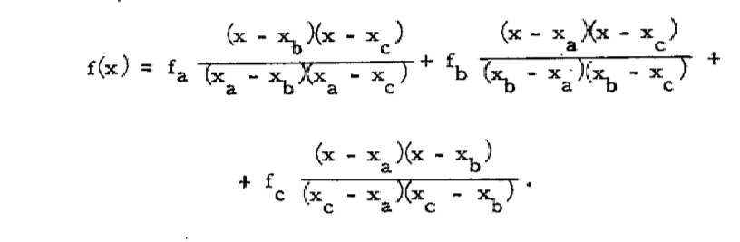
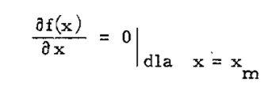
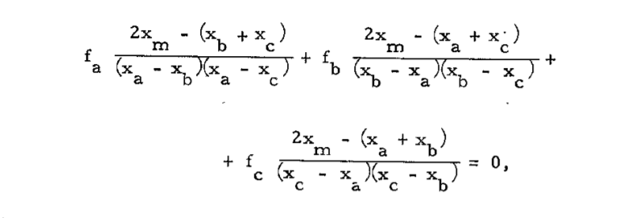
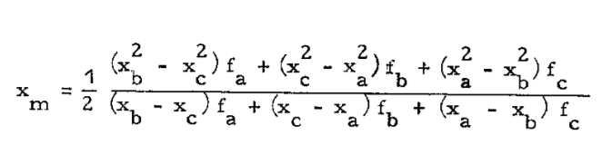

# Metoda interpolacji kwadratowej

Zaletą poprzednio omówionej metody jest duża prostota oraz
bardzo dobra zbieżność uzyskiwana w każdej sytuacji, Wadą jej
natomiast jest niewielka szybkość zbieżności, która jest tym
mniejsza im większą zakłada się dokładność obliczeń minimum

w kierunku, Dla przykładu, jeśli żąda się wyliczenia minimum z
dokładnością 107%, to ilość obliczeń wartości funkcji wynosi ok.
20, Zwróćmy jednak uwagę, że przy wyprowadzeniu metody 'złote-
go podziału" przyjęto bardzo słabe założenia, w których wymagano
tylko ciągłości funkcji oraz istnienia minimum w kierunku, W przy-
padkach gdy założenia te mogą zostać zaostrzone można wtedy po-
służyć się bardziej efektywnym algorytmem opartym o interpolację
kwadratową,

Zakładając, że w otoczeniu minimum w kierunku badaną funk-
cję można zastąpić wielomianem drugiego stopnia, to przy zasto-
sowaniu interpolacji kwadratowej można zbudować dwa następujące
algorytmy:

(1) wartość funkcji jest wyliczana w trzech kolejnych punktach,
przez które zostaje poprowadzony wielomian interpolacyjny dru-
giego stopnia, Następnie dokonujemy predykcji poszukiwanego
ekstremum określając punkt, w którym wartość tego wielomia-
nu osiąga minimum. Z kolei punkt ten zostaje wpro-
wadzony na miejsce jednego z punktów początkowych i opisana
procedura jest powtarzana dotąd, aż zostanie spełnione odpo-
wiednie kryterium zbieżności, Po raz pierwszy algorytm ten
został zastosowany przez Powella. Jednakże przy jego
realizacji zalecana jest ostrożność, gdyż znaleziony punkt mo-
że okazać się maksimum w kierunku, a ponadto niewłaściwa
zamiana punktów wyjściowych może doprowadzić do niezbież-
ności. 

(2) drugim sposobem, zaproponowanym przez Daviesa, Swanna i
Campeya jest wyznaczenie przedziału, w którym znajduje
się minimum, a następnie dopiero zastosowanie interpolacji
kwadratowej.
W rozpatrywanych dalej bezgradientowych metodach poszukiwa-
nia ekstremum przy wyznaczaniu minimum w kierunku posłużono
się algorytmem stanowiącym kompilację obu przytoczonych sposo-
bów. Algorytm ten został zdefiniowany przy pomocy sieci działań
podanych przy omawianiu poszczególnych metod optymalizacji, W al-
gorytmie tym dla wyliczania kolejnej estymaty minimum w kierun-
ku zastosowano wzór zaproponowany przez Powella, który -
wynika z wielomianu interpolacyjnego Lagrange'a w oparciu o na-
'stępujące rozważania,

Załóżmy, że znamy wartości funkcji celu fa, fb i fc, w trzech
kolejnych punktach xa, xb i xc odpowiednio, przy czym
xa< xb<xc, to wykorzystując przyjęte na wstępie założenia, wie-
lomian interpolacyjny Lagrange'a będzie miał postać:

Jak wiadomo warunkiem koniecznym, a w naszym przypadku
i dostatecznym istnienia w punkcie x, ekstremum wyrażenia
jest warunek:

a więc

skąd:

Poza wyprowadzonym wzorem na xm można także stosować
inną jego postać zaproponowaną przez Daviesa, Swanna i Campeya, 
a mianowicie:

przy czym jest ona słuszna tylko w przypadku, gdy zachowane są
równe odległości L pomiędzy bieżącymi punktami xa, xb, i xc
w trakcie obliczeń.

